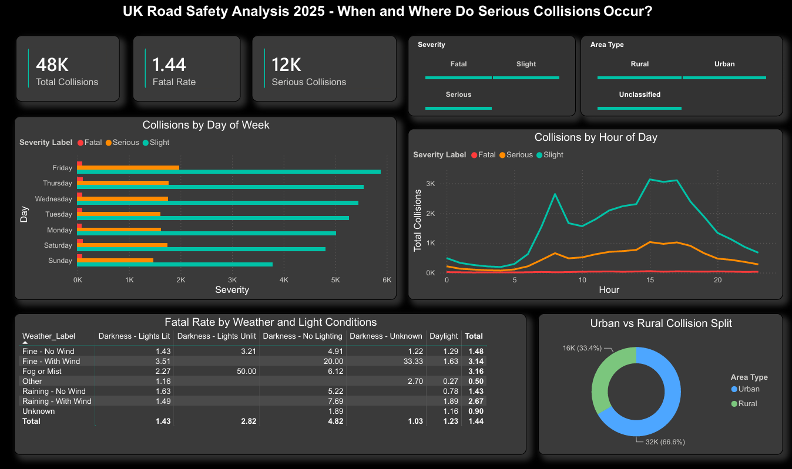

# UK Road Safety Analysis 2025

## Business Questions
**Question 1:** When and where do the most serious road collisions occur 
in England and Wales, and what environmental conditions are most associated 
with fatal and serious casualties?

**Question 2:** Which vehicle types, driver profiles, and road characteristics 
present the highest risk of fatal outcomes, and where should safety 
interventions be prioritised?

## Overview
End-to-end SQL and Power BI analysis of provisional 2025 UK road casualty 
statistics published by the Department for Transport, covering January to 
May 2025. The project combines structured SQL analysis across three linked 
tables with an interactive Power BI dashboard to communicate findings clearly 
to both technical and non-technical audiences.

## Tools Used
- SQL (SQLite) for data analysis and insight generation
- Python (pandas) for data loading and preparation
- Power BI for interactive dashboard development and visualisation

## Dataset
- Source: Department for Transport — Road Safety Data (data.gov.uk)
- Period: January to May 2025 (provisional)
- Collisions: 48,472 records
- Casualties: 60,991 records
- Vehicles: 87,805 records
- Key join field: collision_index

## SQL Techniques Demonstrated
- Aggregations with GROUP BY, COUNT, SUM, and ROUND
- Conditional aggregation using CASE WHEN for severity and label decoding
- Multi-table joins combining collision, casualty, and vehicle data
- Subqueries for filtering and intermediate calculations
- Common Table Expressions (CTEs) for multi-step analysis
- Window functions including RANK(), SUM() OVER(), AVG() OVER(), 
  and PARTITION BY
- HAVING clauses for post-aggregation filtering
- Cumulative window functions for risk indexing and ranking
- UNION ALL for cross-table row count summaries

## Power BI Dashboard
The dashboard contains two pages, one per business question.
### Dashboard Preview

**Page 1 — When and Where**
Covers collision timing by day and hour, environmental conditions including 
weather and light, urban versus rural split, and fatal rate by speed limit.

**Page 2 — Vehicle and Driver Risk**
Covers fatal rate by vehicle type, casualties by age group, collisions by 
speed limit, driver gender analysis, and fatal rate by road type and area.

Screenshots and PDF export available in the dashboard folder.

## Key Findings

**Business Question 1 — When and Where**
- 1.44% of all collisions between January and May 2025 were fatal, 
  representing 696 fatal collisions across the period
- Friday records the highest collision volume of any day while rural 
  Sunday collisions show the highest fatal rate
- Evening rush hour between 4pm and 6pm sees peak collision volumes 
  while late night hours show disproportionately high fatal rates 
  despite lower overall volumes
- Darkness with no street lighting produces significantly higher fatal 
  rates than daylight collisions
- 60mph and 70mph speed limit roads show fatal rates well above the 
  national average while 20mph zones sit significantly below it
- 66.6% of collisions occur in urban areas however rural collisions 
  are significantly more likely to be fatal

**Business Question 2 — Vehicle and Driver Risk**
- Bus or Coach vehicles show the highest fatal involvement rate of any 
  vehicle type, followed by motorcycles which show disproportionate 
  fatal risk relative to their overall numbers
- Dual carriageways in rural areas present the highest combined fatal 
  rate of any road type and area combination at 3.24%
- Male drivers are involved in 73.73% of fatal collisions compared to 
  21.18% for female drivers
- The 26 to 45 age group accounts for the highest volume of casualties 
  however older age groups show higher fatal rates relative to their 
  casualty numbers
- Single carriageways at 60mph present the highest risk combination 
  of road type and speed limit for fatal outcomes

## Project Structure
uk-road-safety-analysis-2025/
├── analysis.sql              # Full SQL analysis across 7 sections
├── README.md                 # This file
└── dashboard/
    ├── UK_Road_Safety_Analysis_2025.pdf
    ├── Page1_When_and_Where.png
    └── Page2_Vehicle_Driver_Risk.png

## How to Run the SQL
1. Download the three CSV files from data.gov.uk Road Safety Data
2. Load into SQLite using DB Browser or Python (pandas + sqlite3)
3. Run analysis.sql section by section in order

## What I Learned
This project demonstrated how government open data can be used to generate 
genuinely actionable public safety insights. The finding that rural Sunday 
collisions have the highest fatal rate, combined with the vulnerability of 
certain vehicle types on high speed roads, points directly to where road 
safety interventions would have the most impact.

Working across three linked tables also deepened my understanding of 
relational data structures and how to use CTEs and window functions to 
break complex multi-dimensional problems into clean, readable analytical 
steps. The Power BI dashboard reinforced the importance of designing 
for a non-technical audience, making sure every visual tells a clear 
story without requiring the viewer to understand the underlying data structure.
